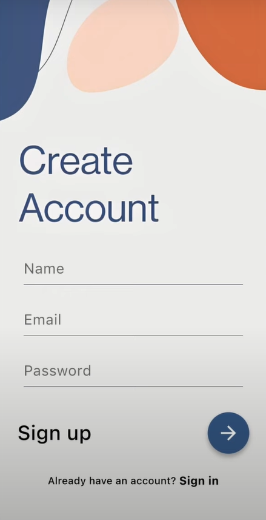
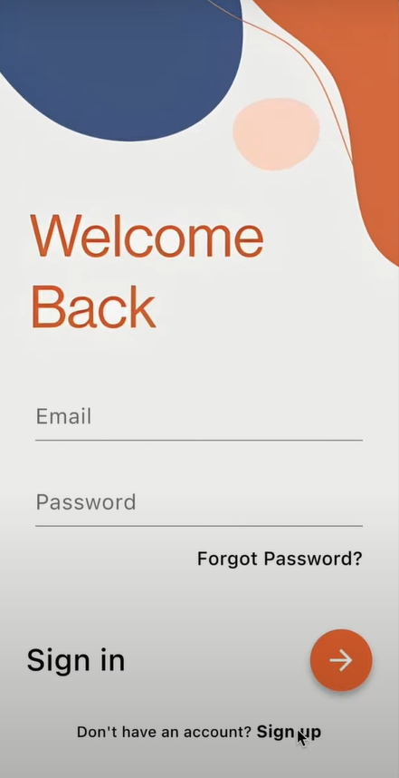
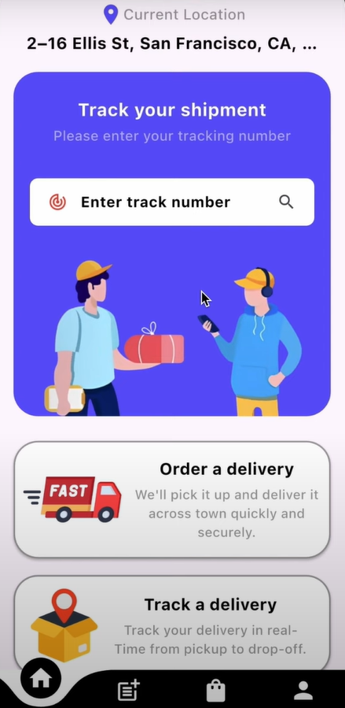
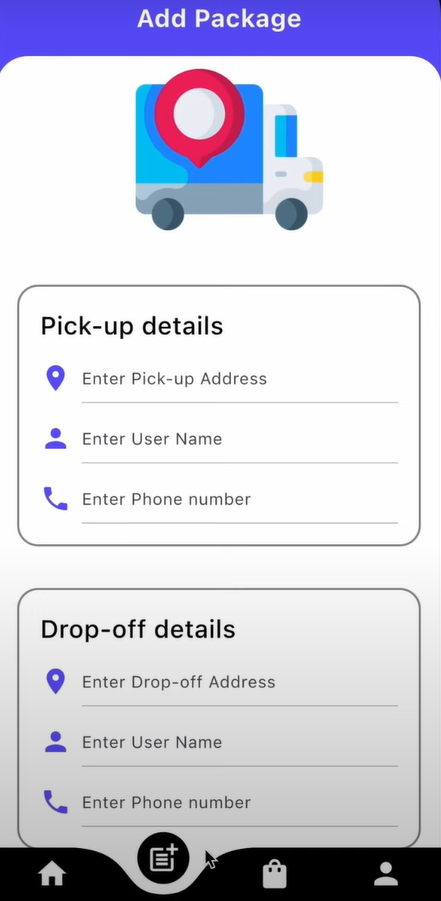
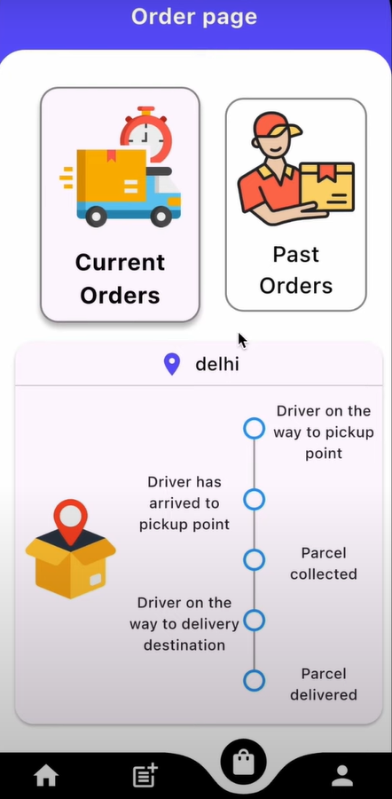
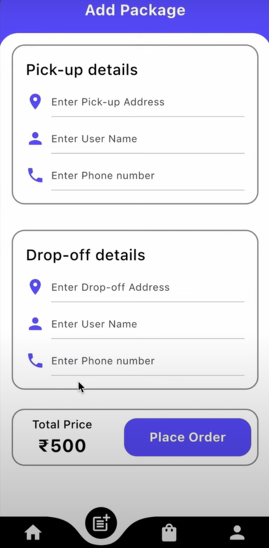
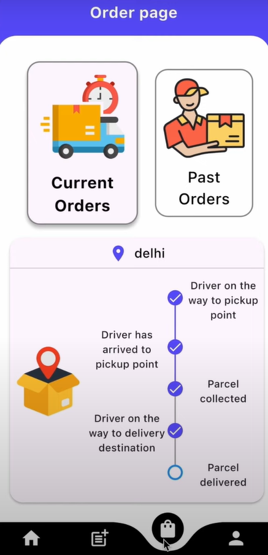
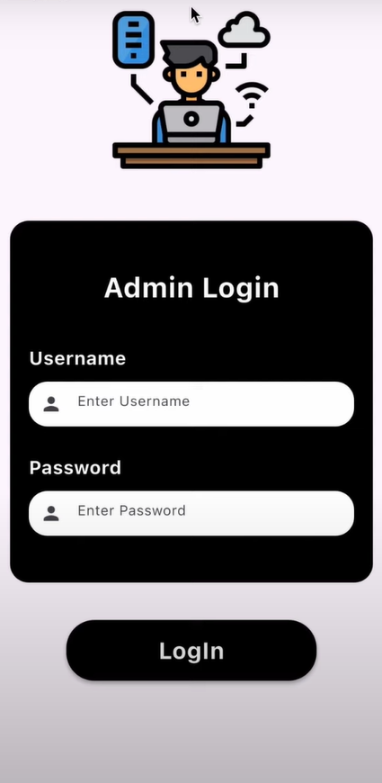
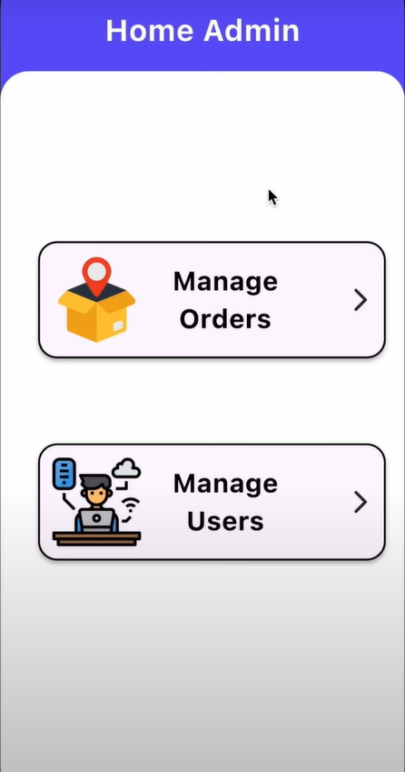
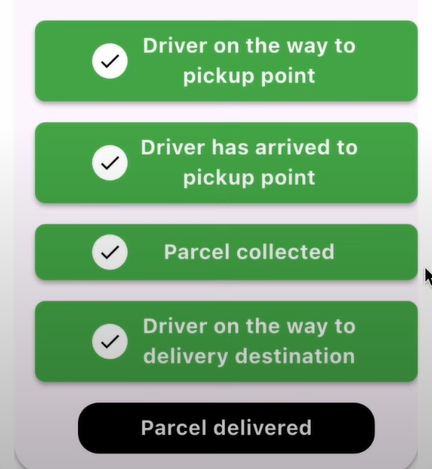

# QuickGrocer 🛒

**QuickGrocer** is a Flutter-based grocery delivery app designed to streamline the process of ordering and delivering groceries from local stores. It includes a user-friendly interface for customers and a robust system for managing orders and deliveries.

---

## ✨ Features

- 🛍️ Browse and select grocery items
- 📦 Place and track orders in real-time
- 👤 Customer and delivery partner profiles
- 🗺️ Google Maps integration for delivery tracking
- 🔔 Push notifications for order updates
- 💬 In-app chat between customers and delivery agents

---

## 🚀 Tech Stack

- **Flutter** – Cross-platform mobile development
- **Firebase** – Authentication, Firestore, and Cloud Messaging
- **Google Maps API** – Route tracking and map views
- **Provider** – State management

---

## 🧑‍💻 Getting Started

### Prerequisites

- Flutter SDK installed
- A Firebase project set up
- Google Maps API key

---

## 📸 Screenshots

*New user account creation.*

*Customer sign-in page.*

*Home Screen showing available groceries.*

*View available delivery packages.*

*Order Tracking screen with map integration.*

*Add new delivery packages.*

*Order status overview.*

*Admin login screen.*

*Admin dashboard.*

*Manage and track incoming orders.*

*Order confirmation animation.*

